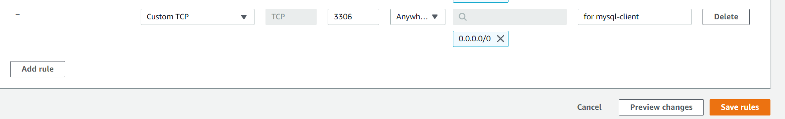
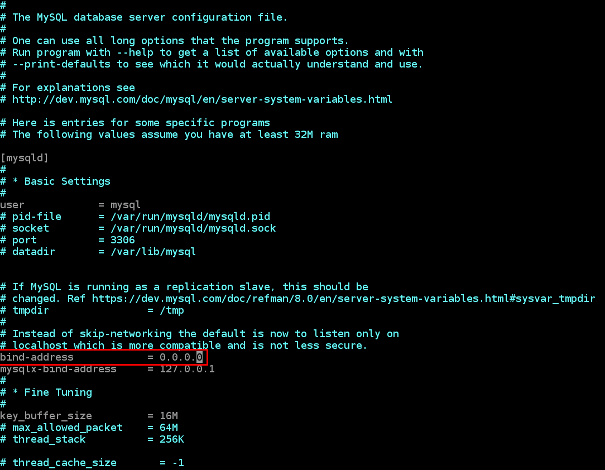

**PROJECT 5:  Implemeent a Client/Server Architecture Using MySQL Relational Database Management System**

## INSTALLING MYSQL SERVER SOFTWARE AND MYSQL CLIENT SOFTWARE

1. On your AWS console create two Ubuntu 20.04 LTS instances and name them "mysql server" and "mysql client"

2. SSH into the mysql server instance from one shell, and into the mysql client instance from another

3. Update and upgrade Ubuntu apt package with the command:

    `sudo apt update`
    ` sudo apt upgrade`

4. On the  **mysql server** install MySQL Server Software and run the Security script following these steps:

    - install the package: `sudo apt-get install mysql-server`

    - confirm installation: `mysql --version` or `mysql -v`

    - if it does not start automatically, run the security script to set up a password for the root user:

        - login to MySQL with ` sudo mysql` 

        - run the SQL query:  ` ALTER USER 'root'@'localhost' IDENTIFIED WITH mysql_native_password BY '<password>';` to set password for the root user 

        - exit MySQL with `exit`

        - run `sudo mysql_secure_installation` to start the security script and secure your password.

            When promoted for the password enter whatever password you set when you ran the above SQL query

        - verify that MySQL is running with `sudo systemctl status mysql`

5. On **mysql client** install MySQL Client Software with the command:

    `sudo apt-get install default-mysql-client`

## ESTABLISHING A CONNECTION BETWEEN MySQL CLIENT AND MySQL SERVER VIA IP ADDRESS

1. TCP 3306 port number is used by MySQL protocol to connect with the MySQL clients and utilities, so you need to edit the inbound rules settings for mysql server and open TCP port 3360 like in the beolow image

    

2. Change the MySQL configuartion settings on **mysql server** so that it allows remote conncetions

- open the file mysqld.cnf `sudo vi /etc/mysql/mysql.conf.d/mysqld.cnf`

- where it says "bind-address" change the value from "127.0.0.1" to "0.0.0.0"

    

3. Before you can access MySQL database from the client you need to grant privileges over to user you will connecting with from the client.  But you will first need to create a new user on MysQL server using the IP address of mysql client server, so that it has access to the database.

- login to MySQL server from the server terminal with `sudo mysql`

- use the `CREATE USER` statement to create a new user:

    mysql> `CREATE USER 'username'@'localhost' IDENTIFIED WITH authentication_plugin BY 'password';`
    
    Substitute fields accordingly. Here the `username` will be the user that is trying to access from the client, in this case the root user of **mysql client**. The `localhost` is mysql client IP address. And enter a strong password where it says `password`

    You can also allow the new user to access the database from anywhere (using IP address 0.0.0.0 as localhost) but for extra security, use only the specific local IP address of your "mysql client".
    
    If the IP address for mysql client is 18.170.3.244 the above statement becomes:

    `CREATE USER root@18.170.3.244 IDENTIFIED WITH authentication_plugin BY password;`

- grant permissions to the new user with the statement: 

    `GRANT 'pemrission' ON 'database' . 'table' TO 'user'@'localhost';`

   **NOTE** the following statement `GRANT ALL PRIVILEGES ON * . * TO 'user'@'localhost';` grants all privileges to a new user, meaning this user will have broad superuser rights similar to the root user's.

   You should be aware when using this statement, as anyone with access to this MySQL account will have complete control over all databases on the server.

    You can instead grant privileges over a single database, or a few privileges to a new user

    The full list of available privileges in MySQL can be found [here](https://dev.mysql.com/doc/refman/8.0/en/privileges-provided.html#privileges-provided-summary)

- once you have a new user with privileges use the statement `FLUSH PRIVILEGES` to make changes effective

4. On **mysql client** terminal run ` mysql --host='ip_address' --user='username' --password`
substituting to ip_address and username the correct values

    - when prompted enter the password you chose for the new user 

    - then check to have you have successfully connected to remote MySQL server by running some SQL queries such as  `SHOW DATABASES;`

